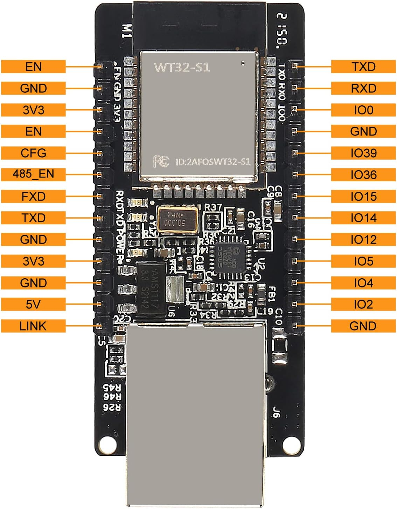

# 🌴 beach-net

**WT32-ETH01 Offline-First LAN Gateway**

`beach-net` is a firmware project for the **WT32-ETH01** that turns the device into a **self-contained LAN gateway** for a remote beach house with **no permanent internet connection**.

The system is designed to work **100% offline**, with **optional internet access** provided later via a mobile phone hotspot.

---

## 📐 Architecture Overview

```
                 (optional WAN)
               iPhone Hotspot
                      |
                 WiFi STA (future)
                      |
               +----------------+
               |  WT32-ETH01    |
               |  LAN Gateway   |
               |  172.18.1.1    |
               +----------------+
                  |          |
            Ethernet LAN   WiFi AP
                  |          |
          +---------------+   |
          | Raspberry Pi  |   |
          | 172.18.1.10   |   |
          +---------------+   |
                              |
                        Mobile / Laptop
```

### Key Principles

* **Offline-first**: LAN operates with no WAN
* **Single gateway**: WT32 is always `172.18.1.1`
* **Ethernet + WiFi AP = same LAN**
* **Security hardware is autonomous** (ESP32 alarm system)
* **Optional WAN** via phone hotspot (added later)

---

## 🧠 Device Roles

| Device         | Role                                    |
| -------------- | --------------------------------------- |
| WT32-ETH01     | LAN gateway, WiFi AP, future WAN router |
| Raspberry Pi   | Flask frontend, security UI, services   |
| ESP32 (Alarm)  | PIR + alarm control (hardware enforced) |
| Phone / Laptop | Admin & monitoring clients              |

---

## 🌐 Network Configuration

* **Subnet:** `172.18.1.0/24`
* **Gateway:** `172.18.1.1` (WT32)
* **Raspberry Pi:** `172.18.1.10` (static)
* **Alarm ESP32:** `172.18.1.240` (static)
* **DHCP clients:** `172.18.1.100+`

The WT32 is the **authoritative gateway** for all LAN devices.

---

## 📦 Features (Current)

* Ethernet LAN with static IP
* WiFi Access Point (DHCP enabled)
* Unified LAN across Ethernet + WiFi
* mDNS discovery (`wt32-beach-gateway.local`)
* Serial diagnostics
* Safe for remote, unattended operation

---

## 🚧 Planned Features

* WiFi STA mode (connect to iPhone hotspot)
* NAT + IP forwarding
* DNS forwarding / fallback
* WAN status detection
* OTA firmware updates
* Watchdog & recovery logic

---

## 🔧 Build & Flashing

### Requirements

* WT32-ETH01
* USB-to-Serial (FTDI / CP2102 / CH340)
* **3.3V logic only**
* External 3.3V regulator recommended

### Flashing Notes

* WT32 has **no USB**
* Flashing requires:

  * `IO0 → GND` during power-up
  * Serial baud: `115200`
* Ethernet **cannot** be used for first flash

---

## ⚙️ Configuration

All site-specific configuration lives in:

```
env.h
```

Including:

* Device ID
* LAN IP settings
* WiFi AP credentials
* Debug enable

This keeps `main.cpp` clean and reusable.

---

## 🧪 Verification Checklist

After flashing:

* [ ] Serial output visible at 115200 baud
* [ ] WiFi AP `BeachHouse-Secure` visible
* [ ] Able to reach `http://172.18.1.10` (Pi)
* [ ] mDNS responds: `wt32-beach-gateway.local`
* [ ] Alarm ESP32 reachable at `172.18.1.240`

---

## 🛡️ Design Philosophy

* **Stability over cleverness**
* **No cloud dependency**
* **Explicit configuration**
* **Field-serviceable**
* **Predictable failure modes**

This system is designed to behave like a **professional remote security LAN**, not a consumer router.

---

## 📁 Project Structure

```
beach-net/
├── src/
│   └── main.cpp
├── include/
│   └── env.h
├── platformio.ini
└── README.md
```

---

## 🌍 WAN via WiFi STA (Mobile Hotspot)

The WT32-ETH01 is designed to optionally provide **internet access** to the LAN by connecting as a **WiFi STA (client)** to a mobile phone hotspot.

This WAN connection is **non-authoritative** and may appear or disappear at any time without affecting LAN operation.

### Design Rules

* LAN **never changes**
* WT32 remains gateway at `172.18.1.1`
* WAN is **NATed**
* LAN devices never talk to the phone directly

### Network Model

```
LAN (always on)
172.18.1.0/24
gateway: 172.18.1.1
        |
   +------------+
   | WT32-ETH01 |
   |   NAT      |
   +------------+
        |
   WiFi STA (WAN)
        |
  iPhone Hotspot
```

### Expected WAN Behavior

* WT32 joins the phone hotspot as a **client**
* WT32 receives a dynamic WAN IP (e.g. `192.168.x.x`)
* All outbound LAN traffic is NATed
* No inbound WAN traffic is allowed
* LAN services continue uninterrupted if WAN drops

### Use Cases

* Software updates
* SSH access
* Remote diagnostics
* Time sync (NTP)

### Non-Goals

* Bridging phone hotspot into LAN
* Exposing LAN devices to the phone
* Cloud dependency for core functionality

> ⚠️ **Important:**
> Internet access is considered **optional convenience**, not a system dependency.

---

## 🧰 On-Site Commissioning Checklist

This checklist is intended for **initial deployment** and **field servicing** at the beach house.

Follow in order.

---

### 🔌 Power & Hardware

* [ ] External 3.3 V regulator connected (≥500 mA)
* [ ] Common ground between WT32 and regulator
* [ ] Ethernet cable connected to LAN switch or Pi
* [ ] Antenna securely attached to WT32

---

### 🔧 Flashing (First-Time Only)

* [ ] USB-to-Serial adapter set to **3.3 V**
* [ ] TX ↔ RX connected correctly
* [ ] IO0 held **LOW** during power-up
* [ ] Serial baud set to **115200**
* [ ] Firmware flashes without errors
* [ ] IO0 released after flashing

---

### 📟 Serial Verification

* [ ] Boot banner visible
* [ ] Ethernet reports **Link UP**
* [ ] Static IP shows as `172.18.1.1`
* [ ] WiFi AP reports **Started**
* [ ] No boot loops or resets

---

### 📡 LAN Verification

* [ ] WiFi AP `BeachHouse-Secure` visible
* [ ] Client receives IP in `172.18.1.x`
* [ ] `ping 172.18.1.1` succeeds
* [ ] Raspberry Pi reachable at `172.18.1.10`
* [ ] Alarm ESP32 reachable at `172.18.1.240`
* [ ] mDNS resolves `wt32-beach-gateway.local`

---

### 🧠 Application Check

* [ ] Flask frontend loads correctly
* [ ] Alarm status visible in UI
* [ ] Arm/disarm commands function
* [ ] Alarm triggers correctly with PIR input
* [ ] System behaves correctly with **no internet**

---

### 🌍 WAN (Optional)

* [ ] Phone hotspot enabled
* [ ] WT32 STA connects successfully
* [ ] WAN IP assigned
* [ ] Outbound internet reachable from Pi
* [ ] LAN continues to function if hotspot disabled

---

### 🛡️ Final Hardening

* [ ] Debug output reviewed
* [ ] AP password confirmed
* [ ] Static IPs documented
* [ ] Power wiring secured
* [ ] Enclosure tamper switches tested
* [ ] System left running unattended for ≥30 min

---

### 📝 Deployment Notes

Record any site-specific details here:

```
Location:
Date:
Firmware version:
Power source:
Notes:
```

---

### 🔌 WT32-ETH01 Flashing & FTDI Wiring

The WT32-ETH01 **does not include USB**.
Initial flashing **must be done via a USB-to-Serial (FTDI) adapter**.

#### WT32-ETH01 Pinout Reference



---

#### FTDI Wiring (Minimum Required)

| WT32 Pin | FTDI Pin          |
| -------- | ----------------- |
| RXD      | TX                |
| TXD      | RX                |
| GND      | GND               |
| 3V3      | 3.3V              |
| IO0      | GND *(boot only)* |

> ⚠️ **Important:**
> IO0 must be held **LOW only during power-up** to enter flash mode.

---

#### Flashing Procedure

1. Connect FTDI (TX/RX/GND)
2. Pull **IO0 → GND**
3. Apply **3.3V power**
4. Start upload (PlatformIO)
5. Release IO0 after flashing begins
6. Reset board if required

---

#### Power Notes

* Ethernet PHY causes high current draw
* External **3.3V regulator (≥500 mA)** is recommended
* FTDI power is acceptable **only for short flashing sessions**
* **Never apply 5V to 3V3 pin**

---

#### Serial Settings

* Baud rate: **115200**
* Data bits: 8
* Parity: none
* Stop bits: 1

---

## ✍️ Notes

This project intentionally avoids:

* Dynamic IP behavior
* Auto role switching
* Cloud dependencies
* Hidden magic

Everything is explicit and observable via serial output.

---

## 📜 License

Private / internal project
(license to be defined if open-sourced later)

---